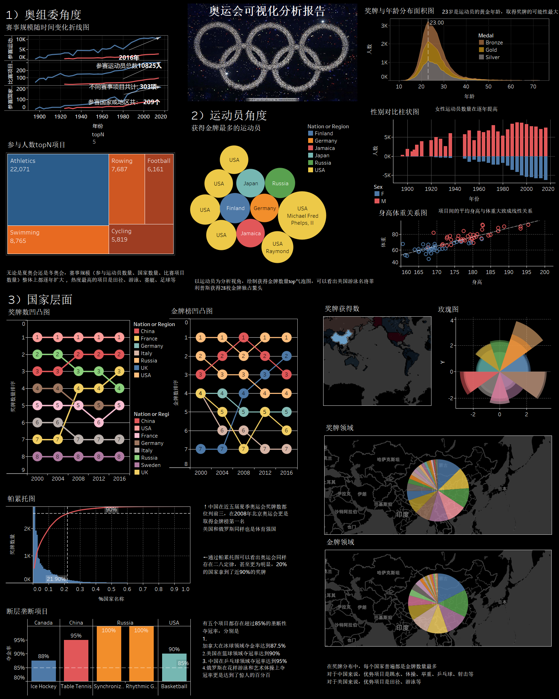

## With the perfect closing of the 2024 Paris Olympics, everyone's enthusiasm for the sporting event has been ignited, and this is a visual analysis of the Olympics.

## 最终绘制的仪表板分为三个视角
### 奥组委视角：
通过绘制时间折线图，可以发现无论是夏奥会还是冬奥会，赛事规模（参与运动员数量、国家数量、比赛项目数量）整体上都逐年扩大

通过绘制树状图，可以发现热度最高的项目是田径、游泳、赛艇、足球等
### 运动员视角：
绘制获得金牌数量top气泡图，可以看出美国游泳名将菲利普斯获得28枚金牌独占鳌头；

通过绘制奖牌年龄面积图可以发现，23岁是运动员的黄金年龄，取得奖牌的可能性最大

通过性别对比柱状图，可以看出女性运动员数量在逐年提高

项目间的平均身高与体重大致成线性关系
### 国家层面：
由于原始数据是以运动员为视角，因此通过Tableau的组合，交叉表功能衍生出来其他信息表

中国在近五届夏季奥运会奖牌数都位列前三，在2008年北京奥运会更是取得金牌榜第一名

美国和俄罗斯同样也是体育强国

通过帕累托图可以看出奥运会同样存在二八定律，甚至更为明显，20%的国家拿到了近90%的奖牌

有五个项目都存在超过85%的垄断性夺冠率，分别是：

（1）	加拿大在冰球领域的夺金率达到87.5%

（2）	美国在篮球领域夺冠率达到90%

（3）	中国在乒乓球领域夺冠率达到95%

（4）	俄罗斯在花样游泳和艺术体操上夺冠率更是达到了惊人的百分百

在奖牌分布中，不同的国家普遍都是金牌数量最多
对于中国来说，优势项目是跳水、体操、举重、乒乓球、射击等

对于美国来说，优势项目是田径、游泳等

## 文件结构
- tableau-Olympic-Games.twbx : 包含数据的tableau工程文件
- data : 初始数据集及可视化构造数据
- tableau-result.png : 最终可视化图片

## reference
- data from：https://www.kaggle.com/datasets/heesoo37/120-years-of-olympic-history-athletes-and-results
